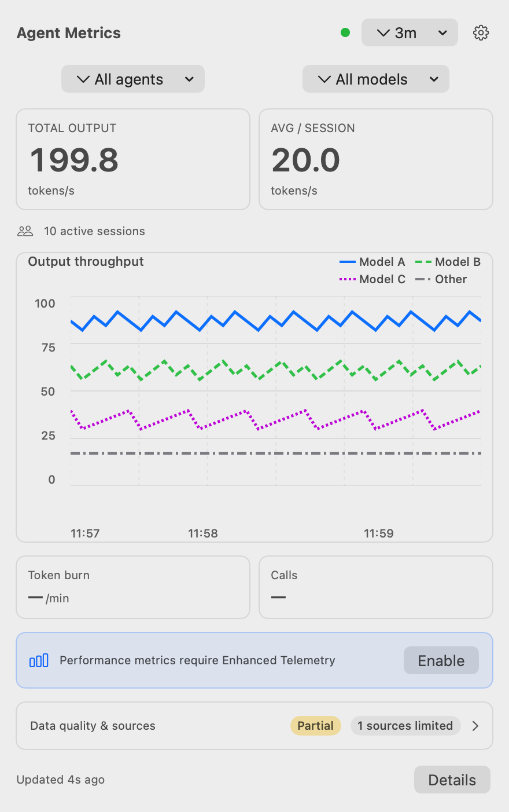

# Agent Metrics

Agent Metrics 是一款原生 macOS 菜单栏应用，用于查看本地 Coding Agent 活动；它不会把不同定义的测量结果假装成可直接互换的数值。

[English](README.md) · [官网](https://patrick-fu.github.io/agent-metrics-macos/) · [GitHub Releases](https://github.com/patrick-fu/agent-metrics-macos/releases)



## 它是什么，以及不是什么

Agent Metrics 读取受支持的本地 Coding Agent 数据，对能够比较的部分进行归一化，并保留来源边界。它是菜单栏中的观察工具，不是 Coding Agent 运行时、计费表、限流表，也不是跨来源的单一评分。

产品当前面向本地 Codex 和 Claude Code 活动。数值可能不可用、过期或仅部分覆盖；这是一种需要理解的结果，不是应被填成零的空位。

## 指标

| 指标 | 定义 | 重要边界 |
| --- | --- | --- |
| **输出吞吐（Output Throughput）** | 选中 Coding Agent 和模型的已观测输出 token，除以同一个滑动窗口时长。Settings 可选 3、5、10 分钟。 | 它是聚合输出吞吐，不是单次 Model Call 的 TPS。 |
| **Token Burn** | 固定 600 秒窗口中已归一化、彼此互斥的输入和输出 token 部分。 | 它不是 TPM 或限流用量；相互重叠的计数不会被相加。 |
| **调用（Calls）** | 滑动窗口中去重后的稳定 Model Call ID，按每分钟表达。 | 稳定 ID 不可得时，Calls 会保持不可用，而非由 Turn 或内容推断。 |
| **解码 TPS（Decode TPS）** | 单次 Model Call 的解码速率，排除首 token 时间。 | 它需要来自增强遥测的可用请求级时序、输出与身份字段；无法关联时会保持不可用。 |

数值的质量、状态、覆盖度、新鲜度、来源权威性与定义版本共同说明其上下文。只有定义与覆盖度兼容的数值才适合比较。

## 来源与边界

| Coding Agent | 默认本地通道 | 增强通道边界 |
| --- | --- | --- |
| **Codex** | 持久化 rollout 使用观测可支持聚合输出与 token 窗口；它们无法恢复持久的单次 Model Call 完成边界。 | 仅在字段与身份可验证时使用请求级观测。 |
| **Claude Code** | 本地转录支持受版本门控，因为其持久化 schema 不是公开稳定契约。 | 通过本地接收器可能取得受支持的请求观测；仅 token 指标无法建立请求时序或稳定调用。 |

Agent Metrics 不会把一个通道的部分观测与另一个通道的字段拼接，也不会在增强观测已替换相同身份和范围内的回退观测后再将其相加。

## 应用界面

- **Summary** 显示经过筛选的输出吞吐、活动、性能可用性和来源健康状态。
- **Trends** 显示随时间变化的 Output Throughput，以及 Token Burn 或 Calls，并提供精确数值表和可见的指标元数据。
- **Settings** 控制登录时启动、输出窗口、菜单栏刷新频率、增强遥测、更新检查，并进入两个详情界面。
- **Data & Diagnostics** 可在内存中预览 allowlist 诊断信息，在复制或保存前请求一次性确认，并准备文本供手动公开 issue 审阅；它不会代你提交 issue。
- **About & Updates** 显示版本、最低 macOS 版本、指标定义、隐私/更新边界，以及需要用户确认的更新检查。

## 可访问性

界面支持键盘焦点、以 Escape 返回的路径，以及 Trends 中不只依赖颜色的提示。人工检查清单覆盖键盘和 VoiceOver 下的筛选器、趋势表、Settings、诊断、重置确认与减少动态效果。它是人工验证清单，并不声称已完成最终 VoiceOver 认证；见 [`docs/accessibility-manual-checklist.md`](docs/accessibility-manual-checklist.md)。

## 要求与安装

Agent Metrics 需要 Apple silicon Mac 和 macOS 14 或更高版本。

GitHub prerelease 是当前的 **Public Beta** 交付策略。发布可用时，从 GitHub Releases 下载 `AgentMetrics-<version>.dmg`，打开它，将 `Agent Metrics.app` 移到 Applications 后启动。一个发布必须通过本项目的签名、公证、stapling 和公开下载检查后，才能被如此表述；当前工作树本身并不能证明未来版本已经发布。

## 本地数据、隐私与重置

Agent Metrics 将归一化后的使用事实存入应用拥有的本地 SQLite。应用声明的网络边界是针对配置更新 feed 的更新检查；诊断信息在任何外部分享前都需要你审阅。

保留策略会保护最近七天。到达警告或硬容量阈值时，旧数据可能被裁剪，覆盖度可能变为部分覆盖。若存储仍处于硬限制，ingestion 可能暂停；应用会报告该状态，而不会悄然把范围当成完整。

诊断使用 allowlist。Reset Data 会移除应用拥有的遥测数据和受管副本，包括迁移备份、观测、事实、rollup、cursor、watermark、来源状态、不透明身份、诊断、运行时快照和应用管理的导出副本。它保留设置、Codex 和 Claude Code 源日志，以及用户在外部保存的文件。清理与空间回收可能仍在等待，并会稍后重试；只卸载应用不会抹除遥测存储。

## 增强遥测

增强遥测默认关闭。启用后，它会启动本应用未鉴权的回环接收器；仅在信任该 Mac 上其他本地进程时启用。接收器归应用所有：启用它不会重新配置 shell 或环境变量，也不会自行配置 Claude Code。它不是只面向 Claude Code 的功能。

## 开发与验证

除上述应用要求外，从源码构建还需要 Xcode 16+ 与 Swift 6.2。

```sh
swift test
swift build
scripts/build-app.sh
open ".build/release/Agent Metrics.app"
```

将 Pages artifact 构建到一个空的临时目录：

```sh
site_output="$(mktemp -d "${TMPDIR:-/tmp}/agent-metrics-site.XXXXXX")"
scripts/build-site.sh "$site_output"
open "$site_output/index.html"
swift test --filter PagesSiteContractTests
```

Pages 构建不需要安装包或外部运行时。`website/site-manifest.txt` 是 allowlist；构建从最新的 `website/updates/appcast.xml` item 派生展示的版本、build 和下载 URL。

## 发布、Pages 与身份

appcast 是生产更新器 feed，并保留已签名的历史 item。Public Beta 标签不会创建第二个更新通道，也不允许仅因存在未发布 prerelease 就将它加入 appcast。遗留 feed `https://patrick-fu.github.io/coding-agent-metrics/updates/appcast.xml` 仍服务已安装客户端；Pages 部署会分别暂存主站点和遗留 feed。见 [`docs/release/pages-deployment.md`](docs/release/pages-deployment.md) 与 [`docs/release/public-beta-runbook.md`](docs/release/public-beta-runbook.md)。

公开应用名为 **Agent Metrics**，bundle 为 `Agent Metrics.app`。`dev.codingagentmetrics.app`、遗留 `CodingAgentMetrics` 模块/资源标识以及 Sparkle trust 配置，都是已安装数据归属与更新连续性所需的兼容标识。

## 排查与已知限制

- **部分覆盖、过期或不可用的值：** 比较前先查看显示出的质量、状态、覆盖度、新鲜度、来源权威性和推荐操作。
- **缺少 Decode TPS 或 Calls：** 所需请求时序或稳定 Model Call ID 可能不可得。不要用 Turn 级数值替代单次调用；启用前先审视增强遥测的信任边界。
- **容量警告或 ingestion 暂停：** 检查 Data & Diagnostics。当存储在硬限制下无法恢复 ingestion 时，Reset Data 是恢复操作。
- **没有本地观测：** 等待受支持来源产生数据，或缩小排除了现有观测的筛选条件。
- **站点或下载不一致：** 本地构建 Pages artifact，并在部署前核验最新 appcast item 的版本、build 和 enclosure。
- **数据迁移后使用旧版应用：** 本项目不承诺数据库降级兼容；兼容性未知时优先发布更高 build 的 roll-forward。

本仓库没有 `LICENSE` 文件。不要推断许可证，也不要称该项目为开源项目。
